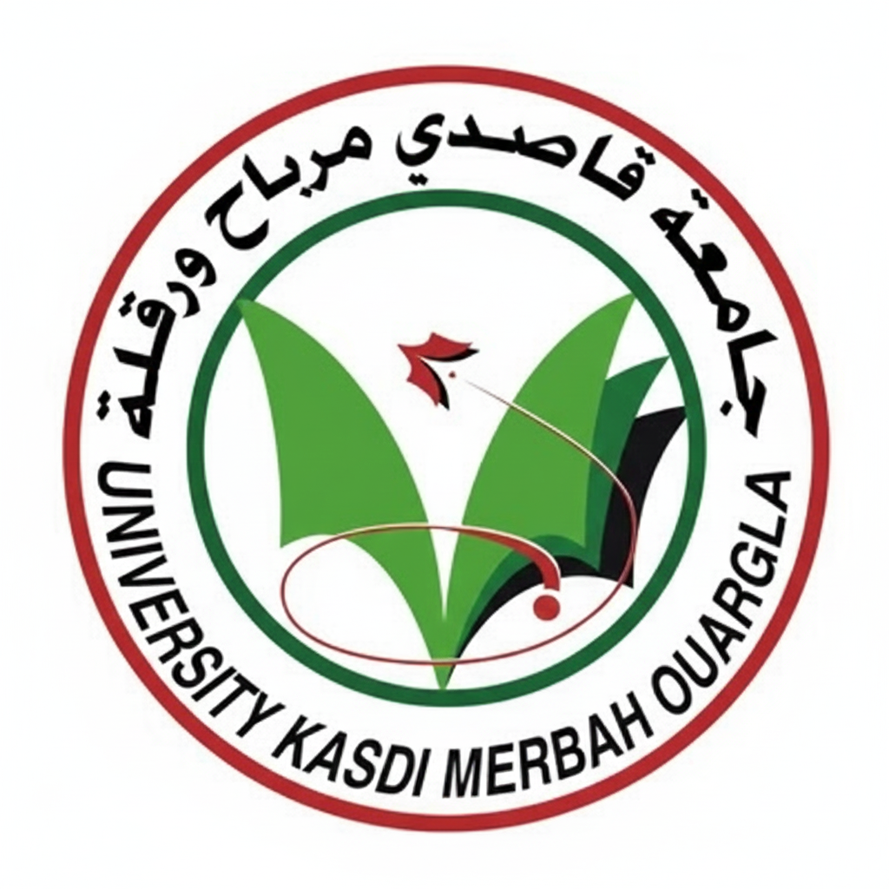
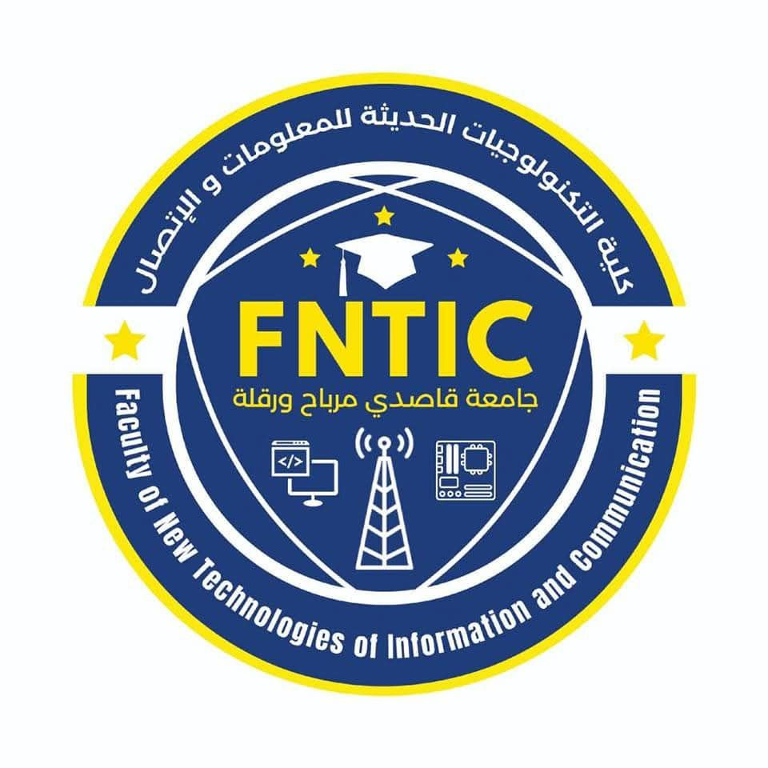
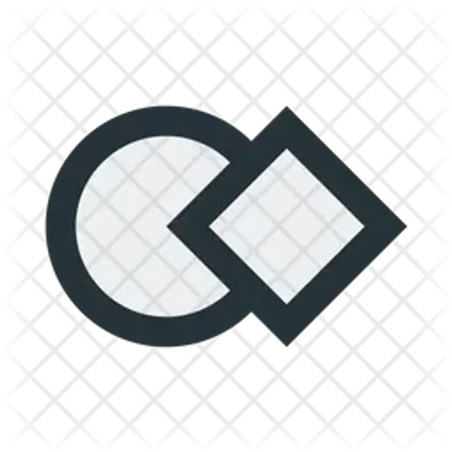

<div align="center">

<table>

<tr>

<td align="center">




</td>

<td align="center">
People’s Democratic Republic of Algeria
Ministry of Higher Education and Scientific Research

</td>

<td align="center">



</td>

</tr>

</table>

# Design and Development of a Web Platform for Brokerage in Craft Services: Khidmati <br>

### name Student's babahammou otmane & felkat sendesse 
</div>

##  ABSTRACT   

This project focuses on the design and development of the comprehensive Khid-
mati platform, an innovative digital solution for facilitating the trade in craft services
in Algeria. The project addresses the structural problems plaguing the Algerian craft
sector, particularly the ineffectiveness of traditional communication channels and the
lack of organized digital platforms to protect the interests of stakeholders. To ensure a
seamless infrastructure, the team adopted the Waterfall Model and the MoSCoW
prioritization technique to bridge the gap between supply and demand. The platform
is built on a modern software architecture: a front-end built with React and Type-
Script, and a back-end built with Node.js and Express.js. A hybrid database model
was implemented, combining MySQL for structured relational data and MongoDB for
unstructured interactions such as messages and notifications. In addition to facilitating
trade, the platform provides legal, accounting, and administrative support to facilitate
the transition of informal sector workers to the formal self-employment economy.
The study concludes (based on results and performance tests) that this platform repre-
sents a vital national standard for digitizing the crafts sector and building an organized
and sustainable digital economy in Algeria.

**Keywords:** Khidmati, SDLC, Waterfall Model, MoSCoW, Hybrid Database

---
## ملخص 
يتناول هذا المشروع تصميم وتطوير منصة خدمتي الإلكترونية الشاملة، التي تعتبر كحل رقمي مبتكر للوساطة في الخدمات الحرفية في الجزائر. يعالج المشروع المشكلات الهيكلية التي يعاني منها قطاع الحرف الجزائري، لاسيما عدم فعالية وسائل الاتصال التقليدية وغياب القنوات الرقمية المنظمة لحماية مصالح أصحاب المصلحة.

لضمان بناء هندسي متكامل، اعتمد الفريق على نموذج الشلال وتقنية تحديد الأولويات (MoSCoW) لسد الفجوة بين العرض والطلب. وتعتمد المنصة على بنية برمجية حديثة: واجهة أمامية مبنية بـ React و TypeScript، وواجهة خلفية بـ Node.js و Express.js. كما تم تطبيق نموذج قاعدة بيانات هجين يجمع بين MySQL للبيانات العلائقية المنظمة، و MongoDB للتفاعلات غير المنظمة كالرسائل والإشعارات.

وإلى جانب الوساطة، تقدم المنصة دعماً قانونياً ومحاسبياً وإدارياً يسهل انتقال العاملين في القطاع غير الرسمي إلى اقتصاد ريادة الأعمال الذاتية الرسمي. وتخلص الدراسة (بناء على نتائج واختبارات الأداء) إلى أن هذه المنصة تمثل معياراً وطنياً حيوياً لرقمنة قطاع الحرف وبناء اقتصاد رقمي منظم ومستدام في الجزائر.

**الكلمات المفتاحية**:
خدمتي، دورة حياة تطوير البرمجيات، نموذج الشلال، 
طريقة موسكو، قاعدة بيانات هجينة، نشر الشبكة الفرعية المحلية

---

## 📑 Report Navigation

| | Navigation | |
|---|---|---|
| ⬅️ Back | [← Contributors](./CONTRIBUTORS.md) | [Introduction →](./Introduction.md) |

**Quick Links:**
- [English Abstract](#abstract) | [Arabic Abstract](#ملخص)
- [Table of Contents](./contents/TableOfContents.md)

## 📄 Citation

Please,If you use this project, its architectural layout, system engineering models, or source code in your academic work, please attribute our dissertation using one of the following citation formats:
#### IEEE Format
```text
Babahammou, O., & Felkat, S. (2026). "Design and Development of a Web Platform for Brokerage in Craft Services: Khidmati". Bachelor's dissertation, University Kasdi Merbah Ouargla.
```

#### BibTeX (For LaTeX / Overleaf Documents) :
``` 
@thesis{khidmati2026,
  author       = {Babahammou, Otmane and Felkat, Sendesse},
  title        = {Design and Development of a Web Platform for Brokerage in Craft Services: Khidmati},
  type         = {Bachelor's dissertation},
  institution  = {University Kasdi Merbah Ouargla},
  department   = {Department of Computer Science and Information Technology},
  school       = {Faculty of New Information and Communication Technologies},
  year         = {2026},
  address      = {Ouargla, Algeria},
  month        = {May}
}
```
## 📄 License

Please read the [Copyright & License Information](./LICENSE) before using this document.

